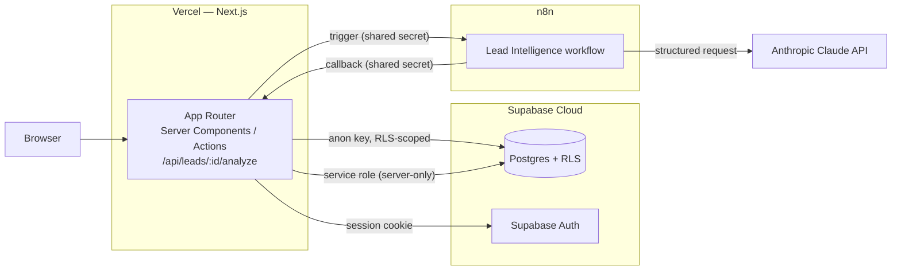

# OpsPilot

AI-powered business operations automation, with human-in-the-loop decisioning built in
from the start rather than bolted on. OpsPilot demonstrates how a real business can
automate repetitive operations — lead triage today, meeting and document intelligence
later — using event-driven workflows (n8n), structured LLM output (Claude), a
multi-tenant Postgres schema with real Row Level Security, and full execution/audit
observability.

**GitHub**: [github.com/daisymilan/opspilot-ai-automation](https://github.com/daisymilan/opspilot-ai-automation)
**Live demo**: not yet deployed — Phase 4 (productionization) is in progress. This
section will be updated with a real URL once Vercel + Supabase Cloud + production n8n
are live and verified; see [docs/production-deployment.md](docs/production-deployment.md)
for the deployment plan and current status. No demo link is published until it has
actually been tested end to end.

## Why this project exists

Most "AI automation" demos either fake the AI response or let it act unchecked. Neither
reflects how this actually has to work in a real business: an LLM call is one step in a
pipeline that also needs schema validation, business rules, a human approval gate for
anything consequential, and an audit trail that survives the AI being wrong, slow, or
unavailable. OpsPilot is built to demonstrate that whole pipeline honestly — including
what it looks like when a step fails, which is treated as a first-class, tested code
path rather than something to hide.

## What it demonstrates

- Next.js (App Router) / React / TypeScript, Server Components + Server Actions
- Supabase / PostgreSQL with real Row Level Security — not an app-layer permission check
- Multi-tenant architecture: every table scoped to an organization, enforced by RLS
- n8n workflow orchestration, decoupled from business logic
- LLM integration (Claude) via a provider-agnostic interface, forced structured tool output
- Zod validation of every AI response before it's trusted
- Human-in-the-loop approval workflows, enforced at the database level
- Execution observability: every automation run is a real, queryable, timestamped record
- Append-only audit logging
- Automated testing: real unit + integration suites (see [Testing](#testing))

## Architecture



n8n owns orchestration only — receiving triggers, calling third-party systems. All
business logic (validation, the AI call, business rules, persistence, approval creation,
execution/audit records) lives in `services/`, callable from a test, an API route, or a
Server Action identically. See [docs/architecture.md](docs/architecture.md) for the full
reasoning and [docs/production-deployment.md](docs/production-deployment.md) for how this
maps onto real infrastructure.

## Lead Intelligence workflow

```
Lead created → n8n → Claude (structured output) → Zod validation → business rules
  → human approval (when required) → execution recorded → audit logged
```

A lead is persisted, then handed to n8n, which calls back into this app's own API route
to run the entire pipeline: idempotency check → real Claude call (forced tool-use
structured output, no free-text parsing) → Zod schema validation → business rules
(confidence threshold + always-review-these-actions list) → an `approvals` row when
required → the execution's terminal state → audit log entries at every step, including
failure. See [docs/lead-intelligence.md](docs/lead-intelligence.md) for the full sequence
diagram and error-handling table.

## Operations Center

A real Dashboard (genuine execution metrics + service health, never fabricated), an
Approval Center (approve/reject with a database-enforced reviewer boundary — RLS, not a
hidden button), and an Execution Explorer with a real audit-event timeline and a
safe-by-construction retry. See [docs/operations-center.md](docs/operations-center.md).

## Security

- **Row Level Security is the actual enforcement boundary**, not the frontend — every
  organization-owned table has RLS enabled and policy-checked against a single
  `current_org_id()` function; verified directly against Postgres in the integration
  suite, not assumed from the frontend hiding a button.
- **Two-tier Supabase client**: an RLS-respecting client for anything a user's own
  session should do, and a `server-only`-guarded service-role client (throws a build
  error if ever imported into client code) for the few tables that are
  service-role-write-only by design (`workflow_executions`, `lead_scores`, `audit_logs`).
- **Webhook trust boundary**: the app↔n8n webhook is authenticated in both directions by
  one shared secret, compared with `crypto.timingSafeEqual` (not `===`, to avoid a
  timing side-channel) — and fails closed (500) if the secret isn't configured at all,
  rather than treating a missing secret as "no auth required."
- **API routes never get an HTML login redirect** — `/api/*` is explicitly excluded from
  the session middleware's redirect logic, so an unauthenticated webhook call gets a real
  401 JSON response, not a 200 HTML login page (a real bug found and fixed via a live
  end-to-end test, not a mock).
- **Server-only secrets never reach the client bundle** — `SUPABASE_SERVICE_ROLE_KEY`,
  `ANTHROPIC_API_KEY`, and n8n's webhook secret are read only in server-only modules; the
  browser only ever sees the RLS-scoped Supabase anon key.

See [docs/architecture.md#rls-strategy](docs/architecture.md#rls-strategy) and
[docs/production-deployment.md](docs/production-deployment.md) for the full model,
including hosted-database verification.

## Testing

Real results from this repository, not inflated:

```
$ npm test                 # unit — pure logic, no external dependencies
 Test Files  11 passed (11)
      Tests  89 passed (89)

$ npm run test:integration  # real local Postgres, RLS actually exercised
 Test Files  3 passed (3)
      Tests  27 passed (27)
```

Unit tests cover Zod schemas, route-protection logic, business rules, execution
formatting/retry rules, approval state transitions, and the AI-provider health
classifier (including a test built from this project's own real captured Anthropic
billing-failure message — see [Known limitations](#known-limitations)). Integration
tests run against a real, unmocked local Supabase instance and prove tenant isolation,
reviewer-role authorization, rejection-reason database constraints, and state
transitions directly against Postgres — not through the frontend.

Playwright (E2E) is part of the target stack but not configured yet — noted honestly
below rather than left implicit.

## Tech stack

| Layer                    | Choice                                                                    |
| ------------------------ | ------------------------------------------------------------------------- |
| Frontend                 | Next.js (App Router), React, TypeScript                                   |
| Styling                  | Tailwind CSS                                                              |
| Database                 | Supabase (PostgreSQL), Row Level Security                                 |
| Auth                     | Supabase Auth                                                             |
| Workflow orchestration   | n8n                                                                       |
| AI (primary)             | Claude (Anthropic), forced structured tool output                         |
| AI (reserved, not built) | OpenAI — provider interface supports it, unused                           |
| Validation               | Zod                                                                       |
| Unit / integration tests | Vitest                                                                    |
| E2E tests                | Playwright (not yet configured)                                           |
| CI                       | GitHub Actions (lint, format, unit tests, build)                          |
| Deployment               | Vercel (app) · Supabase Cloud (database) · Docker-hosted n8n (production) |

## Known limitations

Stated explicitly rather than hidden:

- **Claude billing**: the most recent real, live end-to-end Anthropic API call made in
  this project's development returned a genuine `invalid_request_error` — insufficient
  account credit — not a bug in this codebase. That failure is handled correctly (the
  execution is marked `failed` with the real error preserved, and the dashboard's AI
  health indicator shows `billing_failure`, never a fabricated "healthy"), but a fully
  successful real Claude completion has not been re-verified since. This will be updated
  once re-confirmed against a funded account.
- **No password-reset flow** — not implemented in the app (no route, no Server Action).
- **Meeting Intelligence, Document Intelligence, and Reporting** are planned (see
  [docs/architecture.md](docs/architecture.md#the-four-core-workflows)) but not built.
- **Playwright E2E** is not configured yet — current test coverage is unit + integration
  only (see [Testing](#testing)).
- **Rate limiting**: no bespoke application-level limiter has been added. Signup/login
  abuse is covered by Supabase Auth's own built-in per-IP limits; the n8n webhook
  rejects unauthenticated calls before any real cost is incurred. See
  [docs/production-deployment.md#rate-limiting--abuse-decision-not-adding-a-new-system](docs/production-deployment.md)
  for the full reasoning.

## Project structure

```
opspilot/
├── app/          Next.js App Router routes, layouts, and API routes (app/api/leads/[id]/analyze)
├── components/   UI components (components/ui = presentational primitives)
├── lib/          Framework-agnostic utilities, incl. lib/supabase (client/server/service-role)
├── services/     Business logic: auth, leads, approvals, executions, dashboard, AI, n8n adapter, audit
├── workflows/    n8n workflow definitions (workflows/lead-intelligence.json)
├── supabase/     Migrations + dev-only seed data (source of truth for the schema)
├── scripts/      Operator scripts (e.g. scripts/seed-demo-data.mjs — production demo data only)
├── database/     Human-readable data model docs pointing into supabase/
├── tests/        Vitest unit + integration suites (Playwright later)
├── docs/         Architecture, setup, feature, and production-deployment documentation
├── proxy.ts      Session refresh + route protection (Next.js "proxy" convention)
├── docker-compose.yml  local web + n8n services
└── public/       Static assets
```

See [docs/architecture.md](docs/architecture.md) for the reasoning behind this structure.

## Getting started (local development)

See [docs/development-setup.md](docs/development-setup.md) for full setup instructions,
including the local Supabase stack (requires Docker) and seed login credentials. For the
AI Lead Intelligence flow specifically (n8n + Claude), see
[docs/lead-intelligence.md](docs/lead-intelligence.md#local-setup). For the
Dashboard/Approvals/Executions UI, see [docs/operations-center.md](docs/operations-center.md).
For production deployment, see [docs/production-deployment.md](docs/production-deployment.md).

```bash
npm install
cp .env.example .env.local
npm run db:start   # local Supabase (Postgres + Auth); requires Docker
npm run db:reset   # apply migrations + dev seed data; copy printed keys into .env.local
docker compose up -d n8n   # optional: only needed to trigger real lead analysis
npm run dev
```

Open [http://localhost:3000](http://localhost:3000) — sign up for a new workspace or sign
in with a [seed account](docs/development-setup.md#database).

## Scripts

| Command                        | Purpose                                                                                                                                                           |
| ------------------------------ | ----------------------------------------------------------------------------------------------------------------------------------------------------------------- |
| `npm run dev`                  | Start the development server                                                                                                                                      |
| `npm run build`                | Production build                                                                                                                                                  |
| `npm run start`                | Run the production build                                                                                                                                          |
| `npm run lint`                 | Lint with ESLint                                                                                                                                                  |
| `npm run format`               | Format with Prettier                                                                                                                                              |
| `npm run format:check`         | Check formatting without writing                                                                                                                                  |
| `npm run db:start` / `db:stop` | Start/stop the local Supabase stack (Docker)                                                                                                                      |
| `npm run db:reset`             | Reproduce the database from scratch (migrations + dev seed)                                                                                                       |
| `npm run db:types`             | Regenerate `lib/supabase/database.types.ts`                                                                                                                       |
| `npm test`                     | Unit tests (no external dependencies)                                                                                                                             |
| `npm run test:integration`     | Integration tests against local Supabase (RLS, auth boundary)                                                                                                     |
| `npm run demo:seed`            | Seed a synthetic demo org into a **hosted** project — never local, never automatic (see [docs/production-deployment.md#demo-data](docs/production-deployment.md)) |

## Engineering principles

1. AI never blindly executes sensitive business actions — every sensitive action flows
   through structured output → schema validation → business rules → confidence check →
   human approval (when required) → action → audit log.
2. Every LLM response is validated against a Zod schema before use.
3. Every automation execution is observable (workflow, entity, status, timing, retries, errors).
4. Failure handling is realistic: API failures, rate limits, timeouts, malformed AI output,
   validation failures, duplicates, auth failures, partial workflow failures.
5. Secrets live in environment variables only — see `.env.example`. Server-only secrets
   never reach client code (enforced by the `server-only` package, not just convention).
6. External integrations are never faked silently; unavailable integrations get a documented
   adapter/interface and an explicit development mode.
7. Business logic stays out of the UI layer.
8. n8n owns orchestration and third-party integration; the TypeScript app owns business logic.
9. The AI provider is an injectable interface (`services/ai/types.ts`), not a hardcoded
   SDK call — tests use a `DeterministicTestProvider` that is never called "AI" in
   production and can never be mistaken for a real result (see
   [docs/lead-intelligence.md](docs/lead-intelligence.md#ai-architecture)).
10. Production is the same codebase, not a fork — Phase 4 changed deployment
    configuration and documentation, not application logic. See
    [docs/production-deployment.md](docs/production-deployment.md).

## License

Unlicensed — portfolio project.
